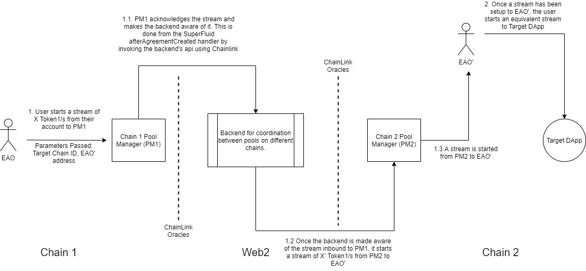
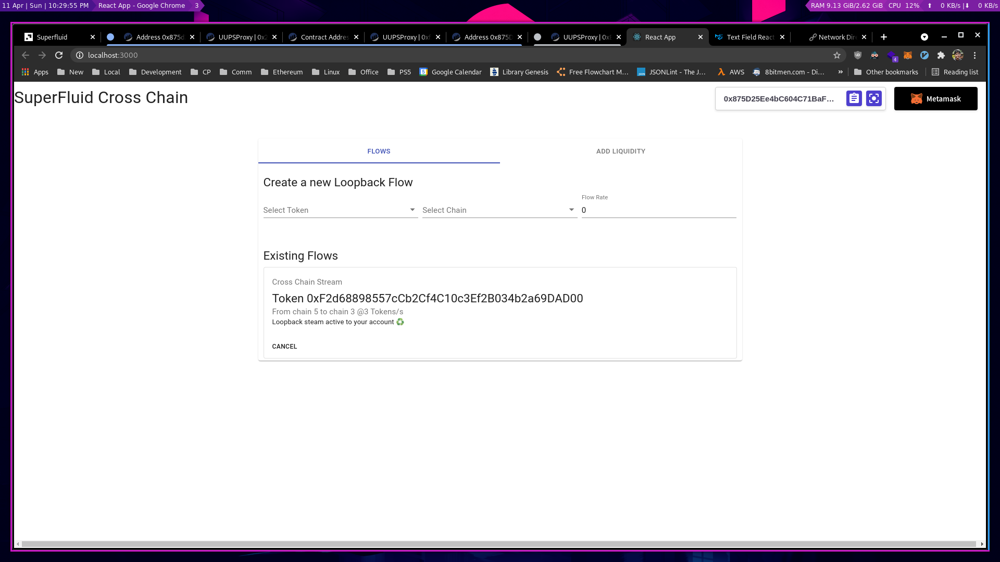
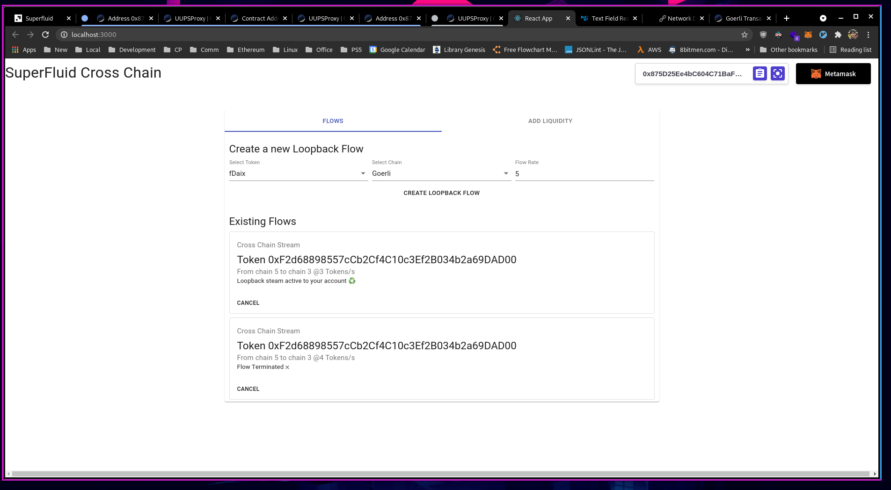
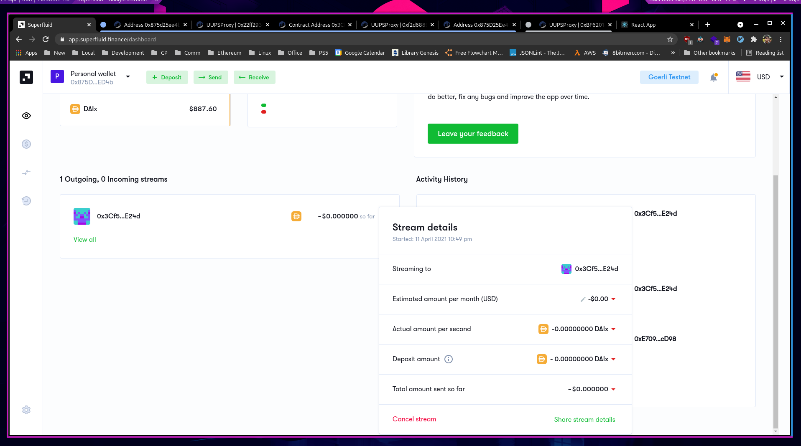
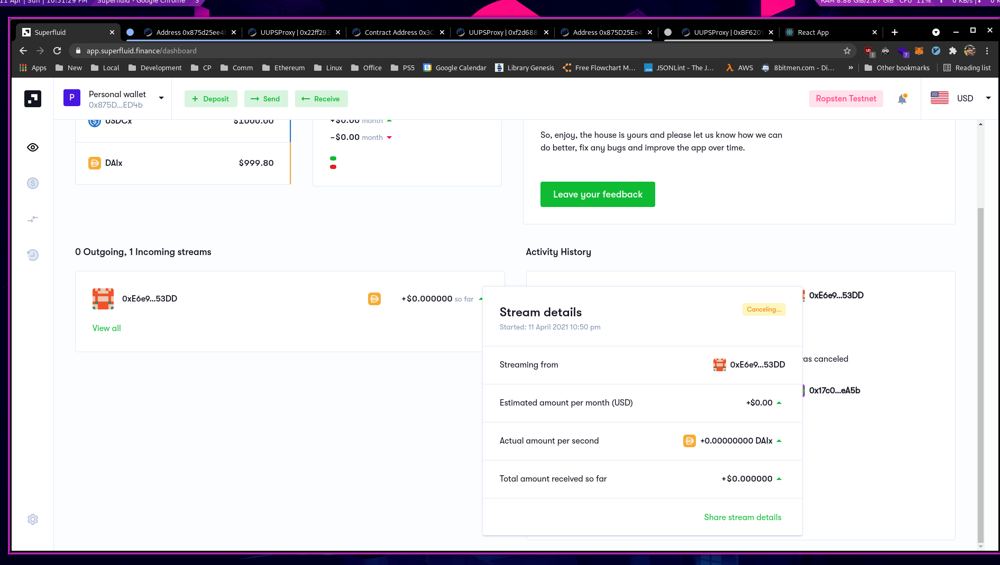

# SuperFluid-Cross-Chain-Externsion

## Objectives

1. Extend the SuperFluid Protocol to allow cross-chain streaming of assets.
2. Extend the SuperFluid Protocol to allow realtime stream asset conversion, ie. a user could create a stream of X Token1/s, but the recipient receives Y Token2/s (where X Tokens1 ≡ Y Token2)

## Use Cases

1. User has assets on mainnet but wants to use a dapp hosted on matic mainnet which uses SuperFluid streams. User may not want to transfer a large amount of assets to matic (periodically), as it would incur a lot of gas over time.
2. A Dapp may accept a superfluid stream in one asset, but the user may not have that asset. Instead of converting their tokens to the required asset, they may utilize (2).

## Architecture
1. Each chain would have contracts called Pool Managers (PM), which will maintain reserves of supertokens of different assets.
2. A web2 backend, which would be responsible for coordination between PMs on different chains. The contracts would communicate with the backend using chainlink oracles.
# Flows

## 1. Cross Chain Streaming

Let EOA and EOA' be addresses controlled by the user on chain 1 and chain 2 respectively, and DApp2 is a contract deployed on chain 2. The goal is to setup a stream from EOA to DApp2, and we break it into two phases:

1. Setup a stream from EOA → EOA'
2. Let the user setup a stream from EOA' → DApp2

This is done so that the user has the option at any time to cancel/edit the stream going to DApp2 without interacting with the rest of the system. This reduces the problem to setting up a stream between EOA and EOA', which is done in the following manner (assuming the value of the Token1 remains unchanged between the chains):

1. EOA sets up a stream of X Token1/s to PM1, and passes the Target Chain ID (2 in this case) and the address of EOA' (could be same or different).
2. This stream fires a callback on PM1, which in turn calls an api on the backend. 
3. The backend would then call a function of PM2 (using ethers), which would setup a stream from PM2 to EAO'.  

A similar flow would take place if the EOA cancel's their stream to PM1, a series of calls would cancel the stream from PM2 to EOA'.

Note: split web2 backend into granular components****

## 2. Asset Conversion

The architecure would look similar to the above. 

1. EAO would start a stream to PM1, passing the target address and the asset into which the stream is to be converted into.
2. If target address resides on the same chain, PM1 would start a stream to it, assuming it has the required supertokens in reserve. The stream rate would depend on the price ratio of the two tokens, which would be fetched from a chainlink oracle.
3. If the target address is on another chain, a flow similar to the above would take place.
## Screenshots
### Creating a cross chain stream, from Goerli to Ropsten

### Confirmation on SuperFluid dashboard

